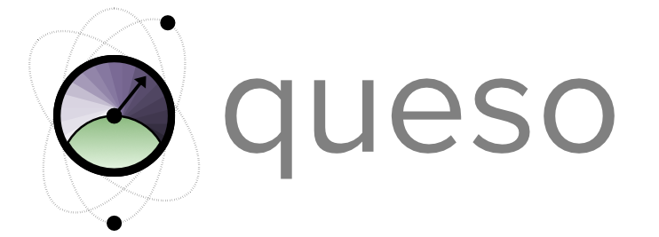
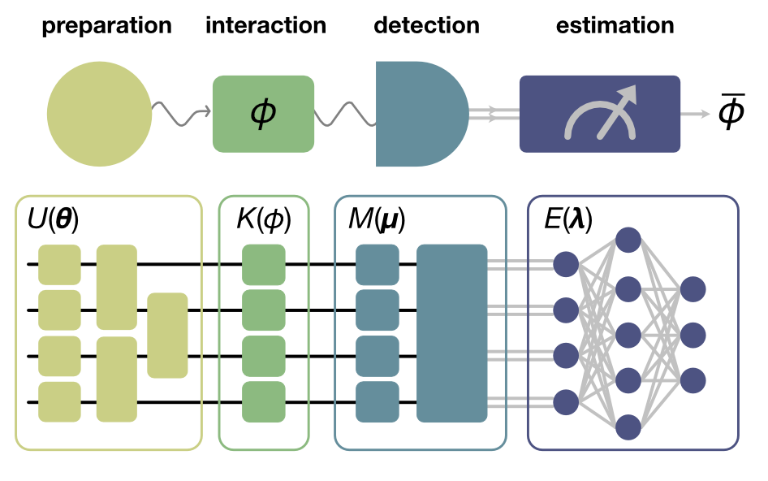

#
<figure markdown>
  { width="350" }
  <figcaption></figcaption>
</figure>


## Variational methods for programmable quantum sensors
[](https://github.com/ki3-qbt/graph-compiler/actions)
[](https://github.com/ki3-qbt/graph-compiler/tree/gh-pages)
[](https://github.com/ambv/black)


!!! note
    Welcome to Queso - a design toolbox for variational quantum sensing protocols. 
    This documentation is still under development, so expect major changes.
    © Benjamin MacLellan, 2023


## What does it do?
Queso is a toolbox for designing, simulating, and benchmarking variational quantum sensing protocols.
<figure markdown>
  { width="400" }
  <figcaption></figcaption>
</figure>

## Basic usage:
```py
import jax
import jax.numpy as jnp
from queso.sensors import Sensor
from queso.estimators import BayesianDNNEstimator

sensor = Sensor(n=4, k=4)

theta, phi, mu = sensor.theta, sensor.phi, sensor.mu
sensor.qfi(theta, phi)
sensor.cfi(theta, phi, mu)
sensor.state(theta, phi, mu)

data = sensor.sample(theta, phi, mu, n_shots=10)

estimator = BayesianDNNEstimator()
posterior = estimator(data)
```


## Install
```bash
pip install git+https://github.com/benjimaclellan/queso.git
```
!!! note
    Official `pip` wheel is in the works.
